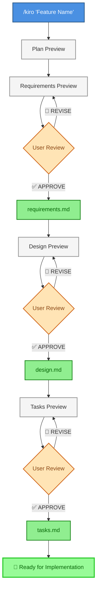
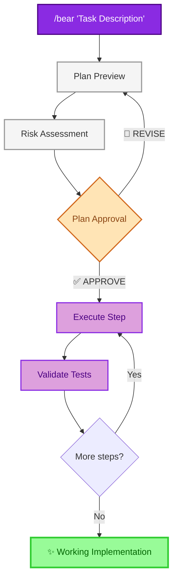
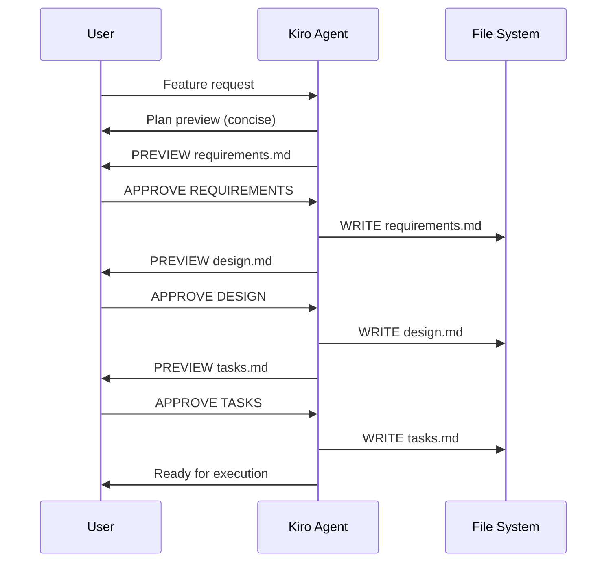
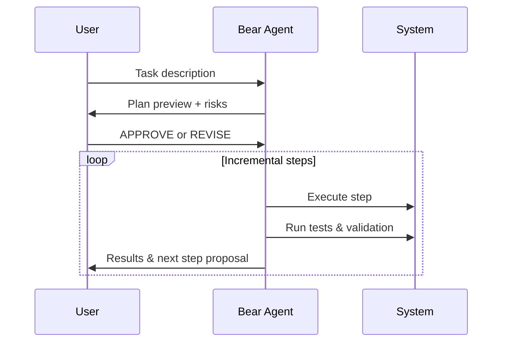

<div align="center">

# 🚀 Codex CLI Alias Installer for Kiro & Bear Agents

[](https://github.com/bizzkoot/Codex-CLI_Kiro-Bear-Profiles/releases)
[](LICENSE)
[](https://www.gnu.org/software/bash/)
[](https://www.apple.com/macos/)

**A production-ready Bash installer for setting up *Kiro* and *Bear* agentic coding workflows with OpenAI Codex CLI.**

*These agents implement Traceable Agentic Development (TAD) patterns optimized for software engineering teams.*

---

</div>

## 📋 Table of Contents

- [🎯 What Are Kiro & Bear?](#-what-are-kiro--bear)
- [🔄 Workflow Overview](#-workflow-overview)
- [🚀 Quick Start](#-quick-start)
- [📖 Usage Guide](#-usage-guide)
- [⚙️ Installation](#️-installation)
- [🎛️ Configuration](#️-configuration)
- [🔧 Troubleshooting](#-troubleshooting)
- [👥 Team Integration](#-team-integration)
- [🤝 Contributing](#-contributing)

---

## 🎯 What Are Kiro & Bear?

**Kiro** and **Bear** are specialized AI agent profiles designed to work together in a structured development workflow:

### 🎯 Kiro - The Strategic Planner
- **Purpose**: Requirements analysis and system design with strict gate controls
- **Workflow**: Plan Preview → Requirements → Design → Tasks (with approval gates)
- **Output**: Structured documentation (`requirements.md`, `design.md`, `tasks.md`)
- **Best for**: New features, architectural changes, complex problem-solving

### ⚡ Bear - The Tactical Executor  
- **Purpose**: Task implementation with deliberate planning and safety checks
- **Workflow**: Plan Preview → Risk Assessment → Incremental Execution (tests each step)
- **Output**: Working code, tests, and incremental progress
- **Best for**: Implementing predefined tasks, debugging, refactoring

## 🔄 Workflow Overview

### Decision Tree: Choose Your Approach

```
📋 New Feature Request
         │
    ┌────▼────┐
    │ Choose  │
    │Approach │
    └─────────┘
         │
    ┌────┼────┐
    ▼    ▼    ▼
   🎯   ⚡   💬
 KIRO  BEAR Direct
```

| **When to Use** | **🎯 Kiro** | **⚡ Bear** | **💬 Direct Codex** |
|---|---|---|---|
| **Best For** | Planning & structure | Clear task definition | Simple questions |
| **Purpose** | Requirements & design | Implementation | Quick answers |
| **Output** | Documentation files | Working code | Direct response |

---

### 🎯 **KIRO Workflow** - Strategic Planning

<div align="center">



</div>

---

### ⚡ **BEAR Workflow** - Tactical Execution

<div align="center">



</div>

---

### 🔄 **Optional: Connecting Workflows**

<div align="center">


</div>

**Why connect them?**
- 🔗 Structured handoff between planning and execution
- 📝 Full traceability from requirements to implementation  
- 🎯 Consistent context across development phases
- 👥 Better team coordination and knowledge sharing

---

### 🎛️ **Model Tier Selection** (Both Agents)

| **Command** | **Tier** | **Cost** | **Speed** | **Best For** |
|-------------|----------|----------|-----------|--------------|
| `/kiro-min` `/bear-min` | Minimal | 💰 Lowest | ⚡ Fastest | Quick tasks, simple queries |
| `/kiro-low` `/bear-low` | Low | 💰 Low | ⚡ Fast | Standard development work |
| `/kiro` `/bear` | Mid (default) | 💰 Balanced | ⚖️ Thorough | Complex features, planning |
| `/kiro-high` `/bear-high` | High | 💰 Premium | 🎯 Most thorough | Critical systems, architecture |

## When to Use Which Agent

### Use Kiro When:
- ✅ Starting a new feature or significant change
- ✅ Requirements are unclear or need refinement  
- ✅ Architecture decisions need to be made
- ✅ You need structured documentation for team review
- ✅ Working on complex, multi-step problems
- ✅ Onboarding new team members (generates clear specs)

### Use Bear When:
- ✅ You have a clear task definition
- ✅ Implementing from existing `tasks.md` 
- ✅ Debugging specific issues
- ✅ Refactoring well-understood code
- ✅ Quick fixes or maintenance tasks
- ✅ Following up on Kiro's planning phase

### Reasoning Tier Selection

Note: Tiers map to reasoning effort levels for the same model, not different model IDs. Defaults target `gpt-5` with effort controls per tier.

| Tier | Effort | Best For | Cost | Speed |
|------|--------|----------|------|-------|
| **min** | `minimal` | Quick tasks, simple queries | Lowest | Fastest |
| **low** | `low` | Standard development work | Low | Fast |
| **mid** | `medium` | Complex features, planning | Medium | Balanced |
| **high** | `high` | Critical systems, architecture | Highest | Most thorough |

---

## 🚀 Quick Start

### 1️⃣ Install & Setup
```bash
# Download and run the installer
bash install_codex_aliases-1.0.2.sh

# Reload your shell
source ~/.zshrc  # or ~/.bashrc
```

### 2️⃣ Verify Installation
```bash
/kiro --help    # Check Kiro is working
/bear --help    # Check Bear is working
```

### 3️⃣ Your First Workflow
```bash
# Plan a feature with Kiro
/kiro "Add user login system"

# Implement a task with Bear  
/bear "Create login form component"
```

---

## ✨ Features

<div align="center">

| 🚀 **Production Ready** | 🖥️ **macOS Compatible** | 🔢 **Flexible Tiers** |
|:---:|:---:|:---:|
| Versioned from v1.0.2 | Works with Bash 3.2+ | Choose by number or name |

| 🤝 **Interactive Flow** | 📂 **Path Handling** | ✍️ **Embedded Playbooks** |
|:---:|:---:|:---:|
| Clear setup prompts | Spaces & `~` expansion | No external dependencies |

| 🛡️ **Safe by Default** | 🎛️ **Multi-Tier Support** | 📋 **Gate-Controlled** |
|:---:|:---:|:---:|
| Asks before overwrite | Cost/performance options | Approval checkpoints |

</div>

---

## ⚙️ Installation

<div align="center">

### 📦 One-Line Installation

```bash
bash install_codex_aliases-1.0.2.sh
```

</div>

---

## 📖 Usage Guide

### 🖱️ Interactive Mode (Recommended)

<div align="center">

| Step | Action | Example |
|:---:|:---|:---|
| 1️⃣ | **Choose tiers to install** | `2,3` → low + mid |
| 2️⃣ | **Decide on fresh global setup** | profiles + shell functions |
| 3️⃣ | **Provide model IDs** | defaults prefilled |
| 4️⃣ | **Confirm playbook overwrites** | if existing files present |
| 5️⃣ | **Reload shell config** | `source ~/.zshrc` |

</div>

### ⚡ Non-Interactive Mode (Automation)

<div align="center">

| Command | Purpose |
|:---|:---|
| `--fresh` | Fresh setup with defaults |
| `--repo /path --force` | Install playbooks into repository |
| `CODEX_TIERS=mid,high --fresh` | Custom tier selection |

</div>

```bash
# Examples
install_codex_aliases-1.0.2.sh --fresh
install_codex_aliases-1.0.2.sh --repo /path/to/repo --force  
CODEX_TIERS=mid,high install_codex_aliases-1.0.2.sh --fresh
```

## Aliases Installed

### Default Aliases (Mid-Tier)
- `/kiro` → Kiro planning agent (mid tier default)
- `/bear` → Bear execution agent (mid tier default)

### Tier-Specific Aliases
- `/kiro-min`, `/bear-min` → Minimal models for quick tasks
- `/kiro-low`, `/bear-low` → Low-cost models for standard work  
- `/kiro-mid`, `/bear-mid` → Balanced models for complex features
- `/kiro-high`, `/bear-high` → Premium models for critical systems

Check them after install:
```bash
/kiro --help    # or any alias to verify installation
```

---

## 💼 Example Workflows

<div align="center">

### 🆕 Scenario 1: New Feature Development

</div>

```bash
# 🎯 Step 1: Plan with Kiro
/kiro "Add user authentication with OAuth2"
# ↳ Generates requirements.md, design.md, tasks.md with approval gates

# ⚡ Step 2: Execute with Bear
/bear "Implement OAuth2 login endpoint from tasks.md" 
# ↳ Executes specific task with safety checks
```

<div align="center">

### ⚡ Scenario 2: Quick Fix

</div>

```bash
# Direct execution for simple tasks
/bear-low "Fix the typo in user validation error message"
```

<div align="center">

### 🏗️ Scenario 3: Architecture Review

</div>

```bash
# Use high-tier for complex architectural decisions
/kiro-high "Design microservice architecture for payment processing"
```

## Workflow Deep Dive

### Kiro's Three-Gate Process

<div align="center">



</div>

### Bear's Planning-to-Execution Flow

<div align="center">



</div>

## Quality Gates & Safety

### Kiro Safety Features
- **No execution in thinking phase** — prevents premature action
- **Preview before write** — every document reviewed before creation
- **EARS requirement format** — structured, testable acceptance criteria
- **Traceability mapping** — links requirements to implementation

### Bear Safety Features  
- **Risk assessment first** — identifies potential issues upfront
- **Step-by-step execution** — incremental progress with checkpoints
- **Test-driven approach** — validates each change
- **Rollback-friendly** — designed for safe iteration

## Requirements

- **Bash 3.2+** (default on macOS is supported)
- **[OpenAI Codex CLI](https://github.com/openai/codex-cli)** installed and available in `PATH`
- **OpenAI API access** with appropriate model permissions
- **Git** (recommended for version control integration)

## Configuration

### Environment Overrides (Non-Interactive)
```bash
export CODEX_MODEL="gpt-5"
export CODEX_REASONING_MIN="minimal"
export CODEX_REASONING_LOW="low"
export CODEX_REASONING_MID="medium"
export CODEX_REASONING_HIGH="high"
export CODEX_TIERS="mid,high"  # Install subset
```

### Post-Installation Setup
The installer creates profiles in `~/.codex/config.toml`:
```toml
[profiles.kiro_mid]
prompt_files = ["codex/kiro.md"]
model = "gpt-5"
model_reasoning_effort = "medium"

[profiles.bear_mid]  
prompt_files = ["codex/bear.md"]
model = "gpt-5"
model_reasoning_effort = "medium"
```

## Troubleshooting

### Common Issues

**"Codex CLI not found"**
```bash
npm install -g @openai/codex
# or
brew install codex
```

**"No such profile"**
```bash
# Verify profiles exist
cat ~/.codex/config.toml | grep -A2 "\[profiles\."
```

**"Playbooks not found"**
```bash
# Ensure playbooks are in the right location
ls -la codex/
# Should show kiro.md and bear.md
```

**Session not resuming properly**
```bash
# Codex CLI currently has limited session persistence
# Work within single sessions for best results
# Track progress in your generated .md files
```

## Team Integration

### Repository Setup
```bash
# Install playbooks in your project
./install_codex_aliases-1.0.2.sh --repo . --force

# Commit the playbooks for team sharing
git add codex/
git commit -m "Add Kiro & Bear agent playbooks"
```

### Team Standards
- Use **Kiro** for all new feature planning
- Use **Bear** for implementation and maintenance  
- **Review generated specs** before approval
- **Version control all artifacts** (requirements.md, design.md, tasks.md)
- **Choose appropriate tiers** based on complexity and budget

---

## 🤝 Contributing

<div align="center">

This is an experimental implementation of **TAD (Traceable Agentic Development)** patterns.

**We welcome contributions! 🎉**

| Type | Welcome |
|:---:|:---|
| 🐛 | Bug reports and fixes |
| 💡 | Workflow improvements |
| 📚 | Documentation enhancements |
| 🔧 | Additional safety features |

</div>

---

## 📄 License

<div align="center">

**MIT License**

*Use at your own risk.*

---

### **Happy coding with structured AI agents! 🚀**

*Built with ❤️ for the developer community*

</div>
