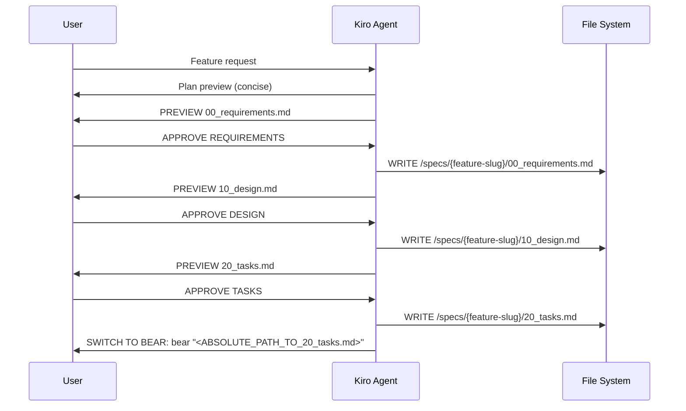
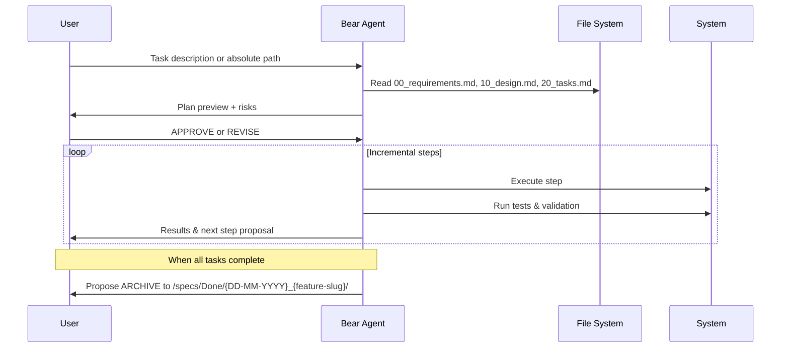

<div align="center">

# 🚀 Codex CLI Embedded Functions: Kiro & Bear Agents

[](https://github.com/bizzkoot/Codex-CLI_Kiro-Bear-Profiles/releases)
[](LICENSE)
[](https://www.gnu.org/software/bash/)
[](https://www.apple.com/macos/)

**Production-ready installer for specialized AI coding agents that implement structured development workflows with OpenAI Codex CLI.**

---

</div>

## What This Does

This script installs two complementary AI agent **shell functions**:

- **🎯 Kiro** - Strategic planner with gated approval workflow for requirements and design  
- **⚡ Bear** - Tactical executor with incremental implementation and safety checks  

Both agents support tiered reasoning models and enforce role-based safety constraints with a structured numbered file workflow.

## Quick Start

```bash
# Download and install
curl -fsSL https://github.com/bizzkoot/Codex-CLI_Kiro-Bear-Profiles/releases/latest/download/codex_interactive_embedded.sh -o codex_interactive_embedded.sh
bash codex_interactive_embedded.sh

# Reload your shell
source ~/.zshrc  # or ~/.bashrc

# Do not run inside Codex CLI prompt. Open a terminal in your project repo and run:
kiro "Plan a user authentication system"
bear "Implement login form component"
```

## Agent Functions

### 🎯 Kiro - The Strategic Planner
- **Purpose**: Requirements analysis and system design  
- **Safety**: Read-only sandbox, untrusted approvals (requires explicit user approval)  
- **Output**: Structured documentation in numbered files (`00_requirements.md`, `10_design.md`, `20_tasks.md`)  
- **Workflow**: Plan → Requirements → Design → Tasks (with approval gates)
- **Features**: EARS-style acceptance criteria, light traceability, incremental updates

### ⚡ Bear - The Tactical Executor
- **Purpose**: Task implementation with deliberate execution  
- **Safety**: Workspace-write sandbox, on-request approvals  
- **Output**: Working code with incremental progress  
- **Workflow**: Plan → Risk Assessment → Execute → Validate (step-by-step)
- **Features**: Context-aware (reads all three planning files); micro-plan preview (≤5 bullets); can bootstrap when no `20_tasks.md` exists; excludes archived specs when resolving tasks; archive flow on completion

## File Structure

The agents create a structured workspace under `/specs/{feature-slug}/`:

```
/specs/
  {feature-slug}/                    # kebab-case from feature name
    00_requirements.md               # Problem framing & acceptance criteria
    10_design.md                     # Architecture & decisions  
    20_tasks.md                      # Actionable tasks (handoff to Bear)
/specs/Done/
  {DD-MM-YYYY}_{feature-slug}/       # Archived completed features
    00_requirements.md
    10_design.md
    20_tasks.md
```

### Why Numbered Files?

- **Natural ordering** in file explorers and GitHub UI without extra tooling
- **Lifecycle clarity** (`00` → requirements, `10` → design, `20` → tasks)
- **Extensible**: insert `15_architecture.md` later without renaming others
- **CI-friendly**: glob `**/20_tasks.md` to enforce rules (e.g., no unchecked items)

### Model Tiers

| Command | Tier | Speed | Cost | Best For |
|---------|------|--------|------|----------|
| `kiro-min` `bear-min` | Minimal | ⚡ Fastest | 💰 Lowest | Quick tasks, simple queries |
| `kiro-low` `bear-low` | Low | ⚡ Fast | 💰 Low | Standard development work |
| `kiro` `bear` | Mid (default) | ⚖️ Balanced | 💰 Medium | Complex features, planning |
| `kiro-high` `bear-high` | High | 🎯 Thorough | 💰 Premium | Critical systems, architecture |

## Workflow Examples

### 🆕 New Feature Development
```bash
# Do not run inside Codex CLI prompt. Open a terminal in your project repo and run:
kiro "Add OAuth2 user authentication"
# After approval gates, Kiro outputs:
# SWITCH TO BEAR: bear "/absolute/path/to/specs/oauth2-user-authentication/20_tasks.md"
bear "/absolute/path/to/specs/oauth2-user-authentication/20_tasks.md"
```

### ⚡ Quick Implementation
```bash
# Do not run inside Codex CLI prompt. Open a terminal in your project repo and run:
bear-low "Fix validation error message typo"
```

### 🏗️ Architecture Design
```bash
# Do not run inside Codex CLI prompt. Open a terminal in your project repo and run:
kiro-high "Design microservice architecture for payment processing"
```

## Kiro-min Walkthrough

This example demonstrates exactly how `kiro-min` behaves from prompt to decision for a simple task. It helps users understand the STRICT planning and artifact-only workflow before switching to Bear for code changes.

### How to Run
```bash
# Run from a regular terminal in your project (not inside Codex CLI prompt)
kiro-min "create a simple Hello World HTML file"
```

<details>
<summary>👀 What You'll See (click to expand) 👀</summary>

Legend
- 🧑‍💻 User Prompt: commands you type
- 🤖 Codex Response: Kiro-min output
- 📄 Kiro Load: reference to embedded profile

🧑‍💻 User Prompt
```bash
kiro-min "create a simple Hello World HTML file"
```

📄 Profile Parameters
```bash
codex 
  --sandbox read-only 
  --ask-for-approval untrusted 
  --model gpt-5 
  --config model_reasoning_effort=minimal 
```

🤖 Codex Response
```text
🎯 KIRO-MIN: Strategic Planning (Minimal Reasoning)

>_ You are using OpenAI Codex in ~/Custom APP/test

▌# Kiro (Codex CLI) — STRICT Planning & Artifacts
▌
▌**Runtime:** Codex CLI profile kiro_min (model: gpt-5, reasoning: minimal).
▌**Goal:** Maintain /specs/{feature-slug}/00_requirements.md, 10_design.md, 20_tasks.md
▌**Location:** All artifacts live under /specs/{feature-slug}/ (kebab-case from feature name; confirm once).
▌
▌## HARD RULE — NEVER edit code files
▌Kiro must not create/modify/delete code files. It only writes these artifacts after APPROVE:
▌- 00_requirements.md
▌- 10_design.md
▌- 20_tasks.md
▌
▌If the user asks to modify code, reply with a single line:
▌SWITCH TO BEAR: bear-min "<ABSOLUTE_PATH_TO_/specs/{feature-slug}/20_tasks.md>"

> I'll scan for existing requirements/design/tasks to resume, then draft a
  concise Requirements PREVIEW for the "Hello World HTML" task.

• Explored
  └ List ls -la
    Search ^#|^##|^\- |^\d+\.  in 00_requirements.md

> Requirements PREVIEW

  - Scope: Provide a single static index.html that renders "Hello, World!" in
  a browser.
  - Out of scope: Styling frameworks, JS frameworks, build tools, deployment,
  asset pipelines.
  - Constraints:
      - Pure HTML5, no external dependencies.
      - Must open and display offline via double-click in common browsers.
      - File name: index.html at project root (or clearly specified output path).
      - Valid minimal semantics: proper <!doctype html>, <html lang>, <head>
  with <meta charset>, and <title>.
  - Acceptance Criteria:
      - AC1: Opening index.html shows the exact text "Hello, World!" visibly in
  the page body.
      - AC2: Document uses HTML5 doctype and includes <meta charset="utf-8">.
      - AC3: File loads without network access or console errors in a modern
  browser.
      - AC4: Page title is "Hello World".

  DECIDE → Reply exactly with one of:

  - APPROVE
  - REVISE: <your changes or constraints>
  - CANCEL
```

🧑‍💻 User Prompt
```bash
▌CANCEL
```

🤖 Codex Response
```text
> Understood — cancelling the workflow. If you want to resume later, just say
  "resume" and I'll start again from Requirements PREVIEW.
```

</details>

### What This Teaches
- **Behavior**: Kiro-min plans only; it does not edit code
- **Safety**: You must APPROVE before any `.md` files are written
- **Handoff**: For code work, Kiro provides exact path to switch to Bear
- **Structure**: Uses numbered files (00_, 10_, 20_) for clear organization

## Workflow Deep Dive

### Kiro's Three-Gate Process



### Bear's Planning-to-Execution Flow



## Installation Options

### Interactive Mode (Recommended)
```bash
bash codex_interactive_embedded.sh
```

### Non-Interactive Mode
```bash
# Auto mode with defaults
bash codex_interactive_embedded.sh --auto

# Install specific tiers
bash codex_interactive_embedded.sh --auto --tiers min,high

# Overwrite existing embedded block without prompting
bash codex_interactive_embedded.sh --auto --mode overwrite

# Skip reinstall if already present
bash codex_interactive_embedded.sh --auto --mode skip

# Delete and reinstall fresh
bash codex_interactive_embedded.sh --auto --mode delete
```

### Command Options
| Option | Description |
|--------|-------------|
| `--auto` | Non-interactive mode using defaults or environment variables |
| `--tiers min,low,mid,high` | Comma-separated reasoning tiers to install (e.g., `min,high`) |
| `--quiet` | Suppress startup messages when functions load |
| `--mode overwrite\|skip\|delete` | Control reinstall behavior when functions already exist |
| `--uninstall` | Remove embedded functions (with interactive backup prompt) |
| `--check` | Show current installation status |
| `--version` | Show script version |
| `--help` | Show usage information |

## Advanced Installation & Usage

### Environment Variables
You can configure the installer via environment variables (useful for CI/CD and scripted installs).

| Variable | Example | Description |
|---|---|---|
| `CODEX_MODEL` | `gpt-5` | Sets the OpenAI model. Defaults to `gpt-5`. |
| `CODEX_TIERS` | `min,low` | Comma-separated list of tiers to install (same as `--tiers`). |
| `CODEX_QUIET` | `1` | Set to `1` to suppress startup messages (same as `--quiet`). |

Example (non-interactive installation):
```bash
# Install only the 'min' and 'high' tiers for model gpt-5, suppressing startup messages
export CODEX_MODEL="gpt-5"
export CODEX_TIERS="min,high"
export CODEX_QUIET=1
bash codex_interactive_embedded.sh --auto
```

### Installed Utility Commands
Besides the `kiro` and `bear` agent functions, the installer adds helpful utilities:

| Command | Description |
|---|---|
| `codex-status` | Summarizes installed functions, version, model, tiers; checks Codex CLI presence. |
| `codex-help` | Prints usage examples for Kiro and Bear. |
| `kiro-test` | Runs a predefined Kiro task using the default tier. |
| `bear-test` | Runs a predefined Bear task using the default tier. |
| `kiro-test-[tier]` | Tests a specific Kiro tier (e.g., `kiro-test-high`). |
| `bear-test-[tier]` | Tests a specific Bear tier (e.g., `bear-test-low`). |

### Important Notes
- **Backup safety**: During install, a timestamped backup of your shell rc (`~/.zshrc` or `~/.bashrc`) is created. During uninstall, you are prompted to optionally create a backup before removal.
- **Shell detection**: The installer detects your shell and targets the appropriate rc file automatically.
- **Tier management**: Can add new tiers to existing installation without losing current setup.
- **Auto mode requirement**: `--auto` validates the Codex CLI is installed and on `PATH`; install `@openai/codex-cli` first or run interactive mode.

## What Gets Installed

### Embedded Functions
Kiro/Bear are exposed as **shell functions** with embedded profiles.  
The installer writes them into your shell rc (e.g., `~/.zshrc`). After installing, open your project folder and run `kiro`/`bear` commands directly.

Available commands:
- `kiro` (default mid), `kiro-min`, `kiro-low`, `kiro-mid`, `kiro-high`  
- `bear` (default mid), `bear-min`, `bear-low`, `bear-mid`, `bear-high`  

### Bear Input Resolution
Bear intelligently resolves different input formats:
- **Preferred (from Kiro handoff)**: `bear "/absolute/path/to/specs/feature-slug/20_tasks.md"`
- **Shorthand**: `bear "login-oauth"` → resolves to `${PWD}/specs/login-oauth/20_tasks.md` (confirms first)
- **No argument**: `bear` → finds most recent non-archived `/specs/**/20_tasks.md` (excludes `/specs/Done/**`) and asks confirmation
- **No tasks found**: Bear can bootstrap by creating `/specs/{feature-slug}/20_tasks.md` with a minimal stub, printing a compact plan (title / files / test), then asking for a decision: `APPROVE`, `REVISE: <edits>`, `CANCEL`, or `AUTO`.

## Requirements

- **Bash 4.0+** (macOS compatible)  
- **[OpenAI Codex CLI](https://github.com/openai/codex-cli)** installed and authenticated  
- **OpenAI API access** with appropriate model permissions  

## Team Integration

- Use **Kiro** for new feature planning  
- Use **Bear** for implementation and maintenance  
- Review generated specs before approval  
- Version control all artifacts (numbered `.md` files)  
- Choose appropriate tiers based on complexity and budget  
- Archive completed features to maintain project history

## Safety Features

### Kiro Safety
- Read-only sandbox (cannot modify code)
- Explicit user approvals required for each planning document
- Preview-before-write for all files  
- Structured workflow enforced with numbered files
- EARS-style acceptance criteria with light traceability

### Bear Safety
- Risk assessment before execution  
- Incremental, validated steps with micro-plans
- Test-driven approach with validation
- Rollback-friendly execution
- Optional confirmation for risky/large changes
- Archive flow for completed work

## Troubleshooting

**"codex CLI not found"**
```bash
npm install -g @openai/codex-cli
```

**Functions not available after install**
```bash
# Reload your shell configuration
source ~/.zshrc  # or ~/.bashrc
```

**Check installation status**
```bash
bash codex_interactive_embedded.sh --check
```

### Uninstallation
```bash
bash codex_interactive_embedded.sh --uninstall
source ~/.zshrc  # Reload shell to remove functions
```

## Contributing

<div align="center">

This is an experimental implementation of **Traceable Agentic Development (TAD)** patterns. We welcome contributions!

- 🐛 Bug reports and fixes  
- 💡 Workflow improvements  
- 📚 Documentation enhancements  
- 🔧 Additional safety features  

</div>

## License

<div align="center">

MIT License - Use at your own risk.

---

**Built for structured AI development workflows** 🚀

</div>
