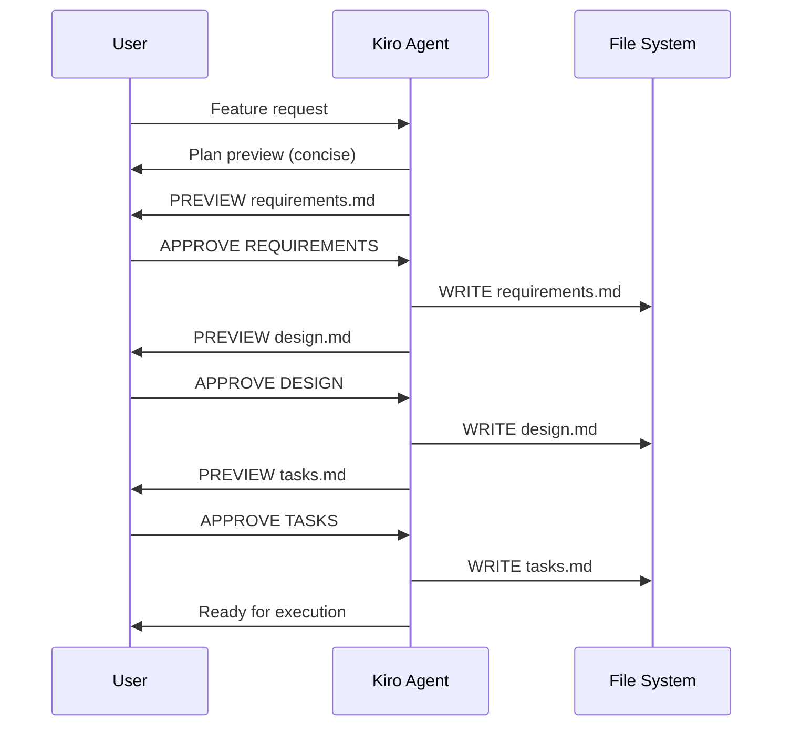
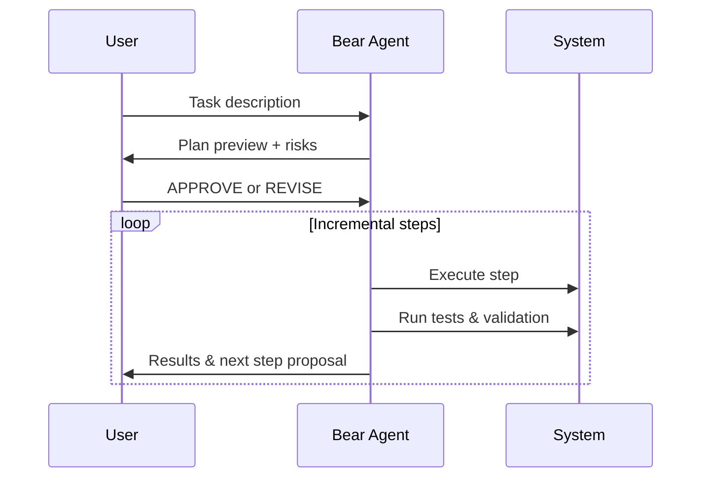

<div align="center">

# 🚀 Codex CLI Profiles: Kiro & Bear Agents

[](https://github.com/bizzkoot/Codex-CLI_Kiro-Bear-Profiles/releases)
[](LICENSE)
[](https://www.gnu.org/software/bash/)
[](https://www.apple.com/macos/)

**Production-ready installer for specialized AI coding agents that implement structured development workflows with OpenAI Codex CLI.**

---

</div>

## What This Does

This script sets up two complementary AI agent profiles:

- **🎯 Kiro** - Strategic planner with gated approval workflow for requirements and design
- **⚡ Bear** - Tactical executor with incremental implementation and safety checks

Both agents work with tiered reasoning models and enforce role-based safety constraints.

## Quick Start

```bash
# Download and install
curl -fsSL https://github.com/bizzkoot/Codex-CLI_Kiro-Bear-Profiles/releases/latest/download/install_codex_aliases.sh -o install_codex_aliases.sh
bash install_codex_aliases.sh --fresh

# Reload your shell
source ~/.zshrc  # or ~/.bashrc

# Try it out
/kiro "Plan a user authentication system"
/bear "Implement login form component"
```

## Agent Profiles

### 🎯 Kiro - The Strategic Planner
- **Purpose**: Requirements analysis and system design
- **Safety**: Read-only sandbox, untrusted approvals (requires explicit user approval)
- **Output**: Structured documentation (`requirements.md`, `design.md`, `tasks.md`)
- **Workflow**: Plan → Requirements → Design → Tasks (with approval gates)

### ⚡ Bear - The Tactical Executor
- **Purpose**: Task implementation with deliberate execution
- **Safety**: Workspace-write sandbox, on-request approvals
- **Output**: Working code with incremental progress
- **Workflow**: Plan → Risk Assessment → Execute → Validate (step-by-step)

### Model Tiers

Both agents support four reasoning effort levels:

| Command | Tier | Speed | Cost | Best For |
|---------|------|--------|------|----------|
| `/kiro-min` `/bear-min` | Minimal | ⚡ Fastest | 💰 Lowest | Quick tasks, simple queries |
| `/kiro-low` `/bear-low` | Low | ⚡ Fast | 💰 Low | Standard development work |
| `/kiro` `/bear` | Mid (default) | ⚖️ Balanced | 💰 Medium | Complex features, planning |
| `/kiro-high` `/bear-high` | High | 🎯 Thorough | 💰 Premium | Critical systems, architecture |

## Workflow Examples

### 🆕 New Feature Development
```bash
# Step 1: Strategic planning with Kiro
/kiro "Add OAuth2 user authentication"
# → Generates requirements.md, design.md, tasks.md with approval gates

# Step 2: Implementation with Bear
/bear "Implement OAuth2 login endpoint from tasks.md"
# → Executes with safety checks and incremental progress
```

### ⚡ Quick Implementation
```bash
# Direct execution for defined tasks
/bear-low "Fix validation error message typo"
```

### 🏗️ Architecture Design
```bash
# High-tier reasoning for complex decisions
/kiro-high "Design microservice architecture for payment processing"
```

## Workflow Deep Dive

### Kiro's Three-Gate Process



### Bear's Planning-to-Execution Flow



## Installation Options

### Interactive Mode (Recommended)
```bash
bash install_codex_aliases.sh
```
Follow prompts to select tiers and configure profiles.

### Non-Interactive Mode
```bash
# Fresh install with defaults
bash install_codex_aliases.sh --fresh

# Custom tier selection
CODEX_TIERS="mid,high" bash install_codex_aliases.sh --fresh

# Repository setup (for teams)
bash install_codex_aliases.sh --repo /path/to/project --force

# Quiet mode (suppress banners)
bash install_codex_aliases.sh --fresh --quiet
```

### Command Options
| Option | Description |
|--------|-------------|
| `--fresh` | Fresh global setup (profiles + aliases) |
| `--repo PATH` | Install to project directory |
| `--force` | Overwrite existing configurations |
| `--quiet` | Suppress profile loaded banners |
| `--no-aliases` | Install profiles only (no shell aliases) |
| `--version` | Show script version |

## What Gets Installed

### Profiles (in `~/.codex/config.toml`)
```toml
[profiles.kiro-mid]
model = "gpt-5-medium"
sandbox_mode = "read-only"
approval_mode = "untrusted"

[profiles.bear-mid]
model = "gpt-5-medium"
sandbox_mode = "workspace-write"
approval_mode = "on-request"
```

### Shell Aliases
- **Default**: `/kiro`, `/bear` (mid-tier)
- **Tiered**: `/kiro-min`, `/kiro-low`, `/kiro-mid`, `/kiro-high`
- **Tiered**: `/bear-min`, `/bear-low`, `/bear-mid`, `/bear-high`

### Banner Display
```text
▶ Kiro profile loaded · tier=mid · model=gpt-5-medium · sandbox=read-only
```

Suppress with: `CODEX_QUIET=1 /kiro "..."`

## Requirements

- **Bash 3.2+** (macOS compatible)
- **[OpenAI Codex CLI](https://github.com/openai/codex-cli)** installed and authenticated
- **OpenAI API access** with appropriate model permissions

## Configuration

### Environment Variables
```bash
export CODEX_TIERS="low,mid,high"      # Install subset of tiers
export CODEX_QUIET=1                   # Suppress banners globally
```

### Model Customization
Override default models per tier:
```bash
export CODEX_MODEL_KIRO_MID="gpt-5-custom"
export CODEX_MODEL_BEAR_HIGH="gpt-5-premium"
```

## Team Integration

### Repository Setup
```bash
# Install profiles in project for team sharing
bash install_codex_aliases.sh --repo . --force
git add codex/
git commit -m "Add Kiro & Bear agent profiles"
```

### Best Practices
- Use **Kiro** for all new feature planning
- Use **Bear** for implementation and maintenance
- Review generated specs before approval
- Version control all artifacts (`.md` files)
- Choose appropriate tiers based on complexity and budget

## Safety Features

### Kiro Safety
- **Read-only sandbox** - Cannot modify files during planning
- **Untrusted approval mode** - Requires explicit user approval for each step
- **Preview-before-write** - Shows content before creating files
- **Structured workflow** - Enforced requirements → design → tasks progression

### Bear Safety
- **Risk assessment first** - Identifies potential issues upfront
- **Incremental execution** - Step-by-step progress with validation
- **Test-driven approach** - Validates each change
- **Rollback-friendly** - Designed for safe iteration

## Troubleshooting

### Common Issues

**"codex CLI not found"**
```bash
npm install -g @openai/codex-cli
# or follow installation guide at: https://github.com/openai/codex-cli
```

**"No such profile"**
```bash
# Verify profiles exist
grep -A2 "\[profiles\." ~/.codex/config.toml
```

**Aliases not working after install**
```bash
# Reload your shell configuration
source ~/.zshrc  # or ~/.bashrc
```

### Uninstallation
```bash
bash install_codex_aliases.sh --uninstall
source ~/.zshrc  # Reload shell to remove functions
```

## Contributing

<div align="center">

This is an experimental implementation of **Traceable Agentic Development (TAD)** patterns. We welcome contributions!

- 🐛 Bug reports and fixes
- 💡 Workflow improvements  
- 📚 Documentation enhancements
- 🔧 Additional safety features

</div>

## License

<div align="center">

MIT License - Use at your own risk.

---

**Built for structured AI development workflows** 🚀

</div>
