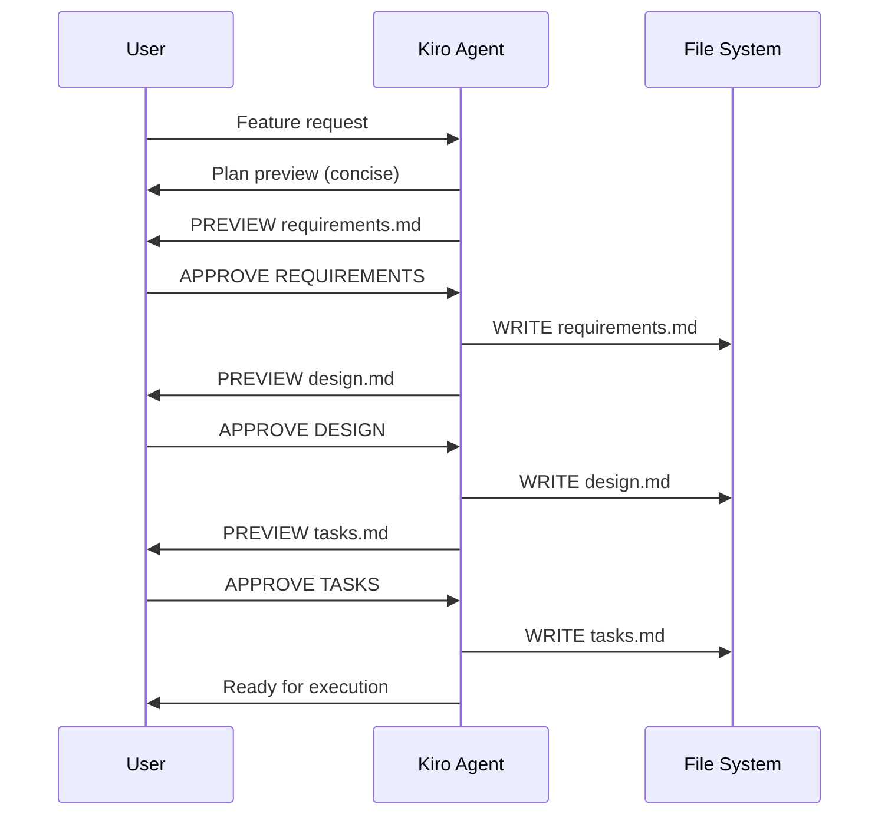
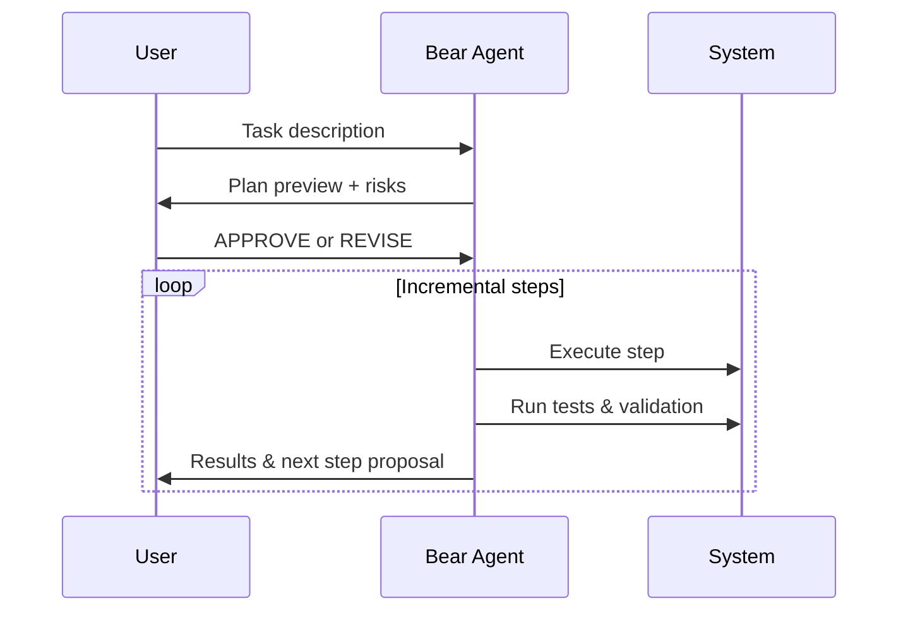

<div align="center">

# 🚀 Codex CLI Embedded Functions: Kiro & Bear Agents

[](https://github.com/bizzkoot/Codex-CLI_Kiro-Bear-Profiles/releases)
[](LICENSE)
[](https://www.gnu.org/software/bash/)
[](https://www.apple.com/macos/)

**Production-ready installer for specialized AI coding agents that implement structured development workflows with OpenAI Codex CLI.**

---

</div>

## What This Does

This script installs two complementary AI agent **shell functions**:

- **🎯 Kiro** - Strategic planner with gated approval workflow for requirements and design  
- **⚡ Bear** - Tactical executor with incremental implementation and safety checks  

Both agents support tiered reasoning models and enforce role-based safety constraints.

## Quick Start

```bash
# Download and install
curl -fsSL https://github.com/bizzkoot/Codex-CLI_Kiro-Bear-Profiles/releases/latest/download/codex_interactive_embedded.sh -o codex_interactive_embedded.sh
bash codex_interactive_embedded.sh

# Reload your shell
source ~/.zshrc  # or ~/.bashrc

# Do not run inside Codex CLI prompt. Open a terminal in your project repo and run:
kiro "Plan a user authentication system"
bear "Implement login form component"
```

## Agent Functions

### 🎯 Kiro - The Strategic Planner
- **Purpose**: Requirements analysis and system design  
- **Safety**: Read-only sandbox, untrusted approvals (requires explicit user approval)  
- **Output**: Structured documentation (`requirements.md`, `design.md`, `tasks.md`)  
- **Workflow**: Plan → Requirements → Design → Tasks (with approval gates)

### ⚡ Bear - The Tactical Executor
- **Purpose**: Task implementation with deliberate execution  
- **Safety**: Workspace-write sandbox, on-request approvals  
- **Output**: Working code with incremental progress  
- **Workflow**: Plan → Risk Assessment → Execute → Validate (step-by-step)

### Model Tiers

| Command | Tier | Speed | Cost | Best For |
|---------|------|--------|------|----------|
| `kiro-min` `bear-min` | Minimal | ⚡ Fastest | 💰 Lowest | Quick tasks, simple queries |
| `kiro-low` `bear-low` | Low | ⚡ Fast | 💰 Low | Standard development work |
| `kiro` `bear` | Mid (default) | ⚖️ Balanced | 💰 Medium | Complex features, planning |
| `kiro-high` `bear-high` | High | 🎯 Thorough | 💰 Premium | Critical systems, architecture |

## Workflow Examples

### 🆕 New Feature Development
```bash
# Do not run inside Codex CLI prompt. Open a terminal in your project repo and run:
kiro "Add OAuth2 user authentication"
bear "Implement OAuth2 login endpoint from tasks.md"
```

### ⚡ Quick Implementation
```bash
# Do not run inside Codex CLI prompt. Open a terminal in your project repo and run:
bear-low "Fix validation error message typo"
```

### 🏗️ Architecture Design
```bash
# Do not run inside Codex CLI prompt. Open a terminal in your project repo and run:
kiro-high "Design microservice architecture for payment processing"
```

## Workflow Deep Dive

### Kiro's Three-Gate Process



### Bear's Planning-to-Execution Flow



## Installation Options

### Interactive Mode (Recommended)
```bash
bash codex_interactive_embedded.sh
```

### Non-Interactive Mode
```bash
# Overwrite existing embedded block without prompting
bash codex_interactive_embedded.sh --mode overwrite

# Skip reinstall if already present
bash codex_interactive_embedded.sh --mode skip

# Delete and reinstall fresh
bash codex_interactive_embedded.sh --mode delete
```

### Command Options
| Option | Description |
|--------|-------------|
| `--mode overwrite|skip|delete` | Control reinstall behavior when functions already exist |
| `--uninstall` | Remove embedded functions (with interactive backup prompt) |
| `--version` | Show script version |

## What Gets Installed

### Embedded Functions
In **v2.0.0**, Kiro/Bear are exposed as **shell functions**.  
The installer writes them into your shell rc (e.g., `~/.zshrc`). After installing, open your project folder and run `kiro`/`bear` commands directly.

Available commands:
- `kiro` (default mid), `kiro-min`, `kiro-low`, `kiro-mid`, `kiro-high`  
- `bear` (default mid), `bear-min`, `bear-low`, `bear-mid`, `bear-high`  

## Requirements

- **Bash 4.0+** (macOS compatible)  
- **[OpenAI Codex CLI](https://github.com/openai/codex-cli)** installed and authenticated  
- **OpenAI API access** with appropriate model permissions  

## Team Integration

- Use **Kiro** for new feature planning  
- Use **Bear** for implementation and maintenance  
- Review generated specs before approval  
- Version control all artifacts (`.md` files)  
- Choose appropriate tiers based on complexity and budget  

## Safety Features

### Kiro Safety
- Read-only sandbox  
- Explicit user approvals required  
- Preview-before-write for all files  
- Structured workflow enforced  

### Bear Safety
- Risk assessment before execution  
- Incremental, validated steps  
- Test-driven approach  
- Rollback-friendly execution  

## Troubleshooting

**"codex CLI not found"**
```bash
npm install -g @openai/codex-cli
```

**Functions not available after install**
```bash
# Reload your shell configuration
source ~/.zshrc  # or ~/.bashrc
```

### Uninstallation
```bash
bash codex_interactive_embedded.sh --uninstall
source ~/.zshrc  # Reload shell to remove functions
```

## Contributing

<div align="center">

This is an experimental implementation of **Traceable Agentic Development (TAD)** patterns. We welcome contributions!

- 🐛 Bug reports and fixes  
- 💡 Workflow improvements  
- 📚 Documentation enhancements  
- 🔧 Additional safety features  

</div>

## License

<div align="center">

MIT License - Use at your own risk.

---

**Built for structured AI development workflows** 🚀

</div>
