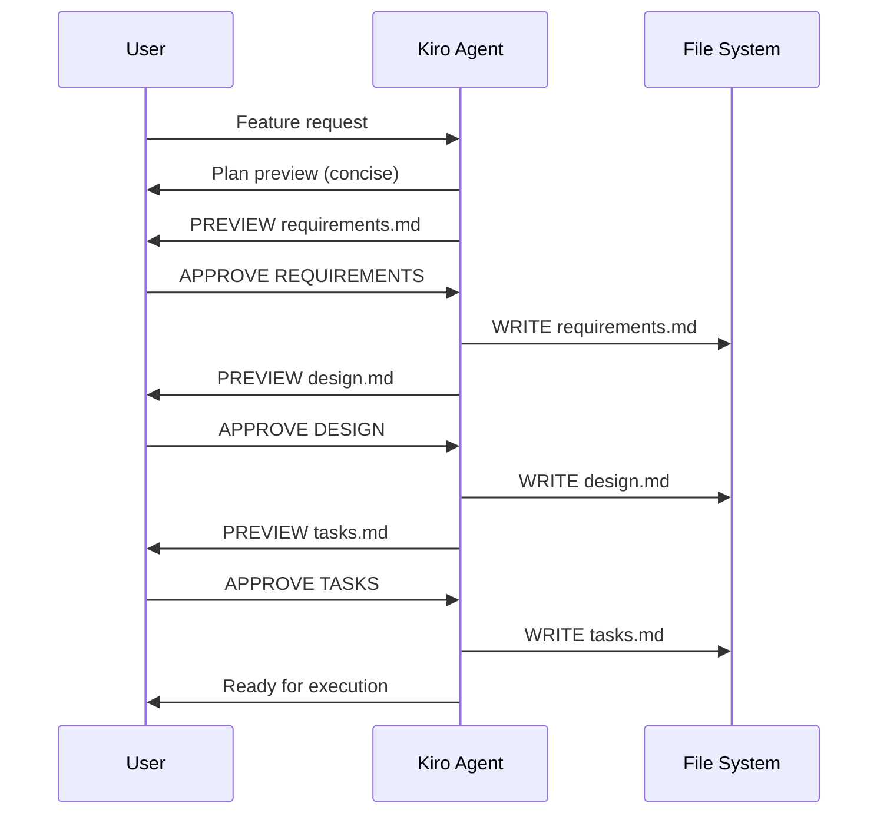
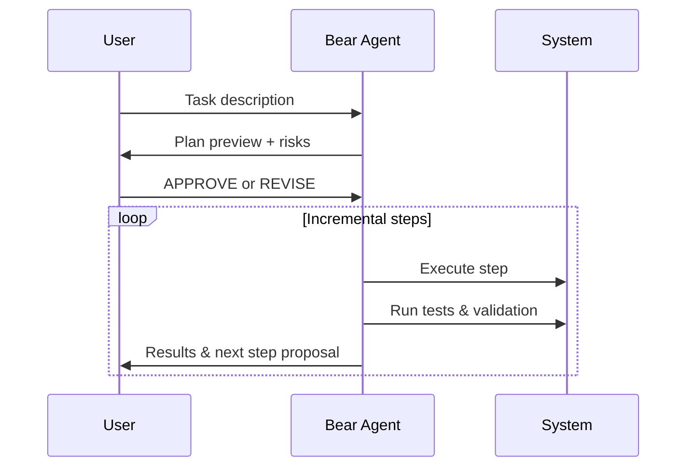

<div align="center">

# 🚀 Codex CLI Embedded Functions: Kiro & Bear Agents

[](https://github.com/bizzkoot/Codex-CLI_Kiro-Bear-Profiles/releases)
[](LICENSE)
[](https://www.gnu.org/software/bash/)
[](https://www.apple.com/macos/)

**Production-ready installer for specialized AI coding agents that implement structured development workflows with OpenAI Codex CLI.**

---

</div>

## What This Does

This script installs two complementary AI agent **shell functions**:

- **🎯 Kiro** - Strategic planner with gated approval workflow for requirements and design  
- **⚡ Bear** - Tactical executor with incremental implementation and safety checks  

Both agents support tiered reasoning models and enforce role-based safety constraints.

## Quick Start

```bash
# Download and install
curl -fsSL https://github.com/bizzkoot/Codex-CLI_Kiro-Bear-Profiles/releases/latest/download/codex_interactive_embedded.sh -o codex_interactive_embedded.sh
bash codex_interactive_embedded.sh

# Reload your shell
source ~/.zshrc  # or ~/.bashrc

# Do not run inside Codex CLI prompt. Open a terminal in your project repo and run:
kiro "Plan a user authentication system"
bear "Implement login form component"
```

## Agent Functions

### 🎯 Kiro - The Strategic Planner
- **Purpose**: Requirements analysis and system design  
- **Safety**: Read-only sandbox, untrusted approvals (requires explicit user approval)  
- **Output**: Structured documentation (`requirements.md`, `design.md`, `tasks.md`)  
- **Workflow**: Plan → Requirements → Design → Tasks (with approval gates)

### ⚡ Bear - The Tactical Executor
- **Purpose**: Task implementation with deliberate execution  
- **Safety**: Workspace-write sandbox, on-request approvals  
- **Output**: Working code with incremental progress  
- **Workflow**: Plan → Risk Assessment → Execute → Validate (step-by-step)

### Model Tiers

| Command | Tier | Speed | Cost | Best For |
|---------|------|--------|------|----------|
| `kiro-min` `bear-min` | Minimal | ⚡ Fastest | 💰 Lowest | Quick tasks, simple queries |
| `kiro-low` `bear-low` | Low | ⚡ Fast | 💰 Low | Standard development work |
| `kiro` `bear` | Mid (default) | ⚖️ Balanced | 💰 Medium | Complex features, planning |
| `kiro-high` `bear-high` | High | 🎯 Thorough | 💰 Premium | Critical systems, architecture |

## Workflow Examples

### 🆕 New Feature Development
```bash
# Do not run inside Codex CLI prompt. Open a terminal in your project repo and run:
kiro "Add OAuth2 user authentication"
bear "Implement OAuth2 login endpoint from tasks.md"
```

### ⚡ Quick Implementation
```bash
# Do not run inside Codex CLI prompt. Open a terminal in your project repo and run:
bear-low "Fix validation error message typo"
```

### 🏗️ Architecture Design
```bash
# Do not run inside Codex CLI prompt. Open a terminal in your project repo and run:
kiro-high "Design microservice architecture for payment processing"
```

## Kiro-min Walkthrough

This example demonstrates exactly how `kiro-min` behaves from prompt to decision for a simple task. It helps users understand the STRICT planning and artifact-only workflow before switching to Bear for code changes.

### How to Run
```bash
# Run from a regular terminal in your project (not inside Codex CLI prompt)
kiro-min "create a simple Hello World HTML file"
```

<details>
<summary>👀 What You’ll See (click to expand) 👀</summary>

Legend
- 🧑‍💻 User Prompt: commands you type
- 🤖 Codex Response: Kiro-min output
- 📄 Kiro Load: reference to kiro.md or profile rules

🧑‍💻 User Prompt
```bash
kiro-min "create a simple Hello World HTML file"
```

📄 Profile Parameters
```bash
codex 
  --sandbox read-only 
  --ask-for-approval untrusted 
  --model gpt-5 
  --config model_reasoning_effort=minimal 
```

🤖 Codex Response
```text
🎯 KIRO-MIN: Strategic Planning (Minimal Reasoning)

>_ You are using OpenAI Codex in ~/Custom APP/test

 To get started, describe a task or try one of these commands:

 /init - create an AGENTS.md file with instructions for Codex
 /status - show current session configuration and token usage
 /approvals - choose what Codex can do without approval
 /model - choose what model and reasoning effort to use

▌# Kiro (Codex CLI) — STRICT Planning & Artifacts (No Chain-of-Thought)
▌
▌**Runtime:** Codex CLI profile kiro_min (model: gpt-5, reasoning: minimal).
▌**Goal:** Maintain requirements.md, design.md, tasks.md via preview → APPROVE/
▌REVISE → write loops.
▌**Resumable:** On re-run, read existing files and propose concise diffs.
▌
▌## HARD RULE — NEVER edit code files
▌Kiro must not create/modify/delete code files. It only writes these artifacts
▌after APPROVE:
▌- requirements.md
▌- design.md
▌- tasks.md
▌
▌If the user asks to modify code, reply with a single line:
▌SWITCH TO BEAR: bear-min "<ABSOLUTE_PATH_TO_tasks.md>"
▌
▌## Behavior
▌- Be concise. Do not print chain-of-thought. Ask ≤2 clarifying questions only
▌if essential.
▌- Prefer EARS-style requirements; keep traceability light.
▌- When updating, show a minimal diff before writing.
▌- Always re-read existing markdowns and update incrementally.
▌
▌## Flow
▌1) Requirements PREVIEW (bulleted): scope, constraints, acceptance criteria
▌(IDs).
▌   Wait for APPROVE or REVISE. If APPROVE → write requirements.md.
▌2) Design PREVIEW (bulleted): components, integration points, risks/
▌mitigations.
▌   Wait for APPROVE or REVISE. If APPROVE → write design.md.
▌3) Tasks PREVIEW: numbered, small, testable tasks, reference AC IDs.
▌   Wait for APPROVE or REVISE. If APPROVE → write/merge tasks.md.
▌
▌After writing/merging tasks.md, output a ready-to-paste handoff line (using the
▌absolute path):
▌SWITCH TO BEAR: bear-min "<ABSOLUTE_PATH_TO_tasks.md>"
▌
▌## Decision Prompt
▌At the end of each PREVIEW, include exactly:
▌DECIDE → Reply exactly with one of:
▌- APPROVE
▌- REVISE: <your changes or constraints>
▌- CANCEL
▌
▌========================= USER TASK =========================
▌
▌USER TASK: create a simple Hello World HTML file

> I’ll scan for existing requirements/design/tasks to resume, then draft a
  concise Requirements PREVIEW for the “Hello World HTML” task.

• Explored
  └ List ls -la
    Search ^#|^##|^\- |^\d+\.  in requirements.md

> Requirements PREVIEW

  - Scope: Provide a single static index.html that renders “Hello, World!” in
  a browser.
  - Out of scope: Styling frameworks, JS frameworks, build tools, deployment,
  asset pipelines.
  - Constraints:
      - Pure HTML5, no external dependencies.
      - Must open and display offline via double-click in common browsers.
      - File name: index.html at project root (or clearly specified output
  path).
      - Valid minimal semantics: proper <!doctype html>, <html lang>, <head>
  with <meta charset>, and <title>.
  - Acceptance Criteria:
      - AC1: Opening index.html shows the exact text “Hello, World!” visibly in
  the page body.
      - AC2: Document uses HTML5 doctype and includes <meta charset="utf-8">.
      - AC3: File loads without network access or console errors in a modern
  browser.
      - AC4: Page title is “Hello World”.

  DECIDE → Reply exactly with one of:

  - APPROVE
  - REVISE:
  - CANCEL
```

🧑‍💻 User Prompt
```bash
▌CANCEL
```

🤖 Codex Response
```text
> Understood — cancelling the workflow. If you want to resume later, just say
  “resume” and I’ll start again from Requirements PREVIEW.
```

</details>

### What This Teaches
- Behavior: Kiro-min plans only; it does not edit code.
- Safety: You must APPROVE before any `.md` files are written.
- Handoff: For code work, respond with the handoff line to switch to Bear.


## Workflow Deep Dive

### Kiro's Three-Gate Process



### Bear's Planning-to-Execution Flow



## Installation Options

### Interactive Mode (Recommended)
```bash
bash codex_interactive_embedded.sh
```

### Non-Interactive Mode
```bash
# Overwrite existing embedded block without prompting
bash codex_interactive_embedded.sh --mode overwrite

# Skip reinstall if already present
bash codex_interactive_embedded.sh --mode skip

# Delete and reinstall fresh
bash codex_interactive_embedded.sh --mode delete
```

### Command Options
| Option | Description |
|--------|-------------|
| `--mode overwrite|skip|delete` | Control reinstall behavior when functions already exist |
| `--uninstall` | Remove embedded functions (with interactive backup prompt) |
| `--version` | Show script version |

## Advanced Installation & Usage

The installer supports additional flags and environment variables for automated or customized setups.

### Command-Line Arguments
| Flag | Argument | Description |
|---|---|---|
| `--auto` | (none) | Non-interactive mode using defaults or environment variables. Installs the `mid` tier by default. |
| `--tiers` | `min,low,mid,high` | Comma-separated reasoning tiers to install (e.g., `min,high`). |
| `--quiet` | (none) | Suppresses startup messages when a new terminal session loads the functions. |
| `--check` | (none) | Prints current installation status and Codex CLI availability without making changes. |
| `--uninstall` | (none) | Removes embedded functions from your shell rc with an interactive backup prompt. |
| `--help` | (none) | Shows help/usage information. |

### Environment Variables
You can configure the installer via environment variables (useful for CI/CD and scripted installs).

| Variable | Example | Description |
|---|---|---|
| `CODEX_MODEL` | `gpt-5` | Sets the OpenAI model. Defaults to `gpt-5`. |
| `CODEX_TIERS` | `min,low` | Comma-separated list of tiers to install (same as `--tiers`). |
| `CODEX_QUIET` | `1` | Set to `1` to suppress startup messages (same as `--quiet`). |

Example (non-interactive installation):
```bash
# Install only the 'min' and 'high' tiers for model gpt-5, suppressing startup messages
export CODEX_MODEL="gpt-5"
export CODEX_TIERS="min,high"
export CODEX_QUIET=1
bash codex_interactive_embedded.sh --auto
```

### Installed Utility Commands
Besides the `kiro` and `bear` agent functions, the installer adds helpful utilities:

| Command | Description |
|---|---|
| `codex-status` | Summarizes installed functions, version, model, tiers; checks Codex CLI presence. |
| `codex-help` | Prints usage examples for Kiro and Bear. |
| `kiro-test` | Runs a predefined Kiro task using the default tier. |
| `bear-test` | Runs a predefined Bear task using the default tier. |
| `kiro-test-[tier]` | Tests a specific Kiro tier (e.g., `kiro-test-high`). |
| `bear-test-[tier]` | Tests a specific Bear tier (e.g., `bear-test-low`). |

### Important Notes
- Backup safety: During install, a timestamped backup of your shell rc (`~/.zshrc` or `~/.bashrc`) is created. During uninstall, you are prompted to optionally create a backup before removal.
- Shell detection: The installer detects your shell and targets the appropriate rc file automatically.

## What Gets Installed

### Embedded Functions
In **v2.0.0**, Kiro/Bear are exposed as **shell functions**.  
The installer writes them into your shell rc (e.g., `~/.zshrc`). After installing, open your project folder and run `kiro`/`bear` commands directly.

Available commands:
- `kiro` (default mid), `kiro-min`, `kiro-low`, `kiro-mid`, `kiro-high`  
- `bear` (default mid), `bear-min`, `bear-low`, `bear-mid`, `bear-high`  

## Requirements

- **Bash 4.0+** (macOS compatible)  
- **[OpenAI Codex CLI](https://github.com/openai/codex-cli)** installed and authenticated  
- **OpenAI API access** with appropriate model permissions  

## Team Integration

- Use **Kiro** for new feature planning  
- Use **Bear** for implementation and maintenance  
- Review generated specs before approval  
- Version control all artifacts (`.md` files)  
- Choose appropriate tiers based on complexity and budget  

## Safety Features

### Kiro Safety
- Read-only sandbox  
- Explicit user approvals required  
- Preview-before-write for all files  
- Structured workflow enforced  

### Bear Safety
- Risk assessment before execution  
- Incremental, validated steps  
- Test-driven approach  
- Rollback-friendly execution  

## Troubleshooting

**"codex CLI not found"**
```bash
npm install -g @openai/codex-cli
```

**Functions not available after install**
```bash
# Reload your shell configuration
source ~/.zshrc  # or ~/.bashrc
```

### Uninstallation
```bash
bash codex_interactive_embedded.sh --uninstall
source ~/.zshrc  # Reload shell to remove functions
```

## Contributing

<div align="center">

This is an experimental implementation of **Traceable Agentic Development (TAD)** patterns. We welcome contributions!

- 🐛 Bug reports and fixes  
- 💡 Workflow improvements  
- 📚 Documentation enhancements  
- 🔧 Additional safety features  

</div>

## License

<div align="center">

MIT License - Use at your own risk.

---

**Built for structured AI development workflows** 🚀

</div>
